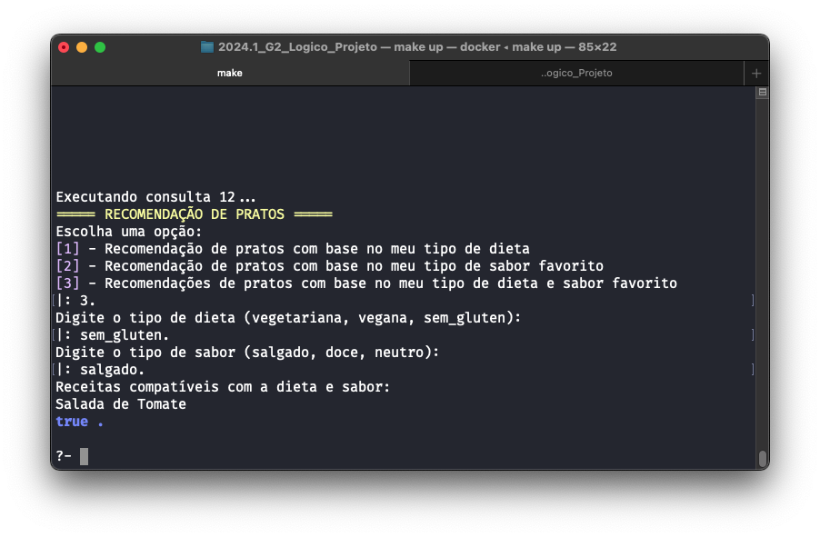

# O Que Tem Pra Comer?

**Disciplina**: FGA0210 - PARADIGMAS DE PROGRAMAÇÃO - T01 <br>
**Nro do Grupo (de acordo com a Planilha de Divisão dos Grupos)**: 02<br>
**Paradigma**: Lógico<br>

## Alunos
|Matrícula | Aluno |
| -- | -- |
|Ailton Aires|180011600|
|Arthur Sena|180030345|
|Eric Chagas de Oliveira|180119508|
|Fernando Vargas|180016491|
|Gabriel Luiz|190013354|
|Guilherme Daniel Fernandes da Silva|180018019|
|Kevin Luis|180042386|
|Thiago Vivan|190020407|
|Victor Buendia|190020601|

## Sobre 
*O Que Tem Pra Comer?* é um projeto que visa auxiliar pessoas indecisas na hora de escolher o que comer. Inicialmente o projeto foi inspirado em uma plataforma chamada [SuperCook](https://www.supercook.com/#/desktop). A ideia é que o usuário informe os ingredientes que possui em casa, e o sistema irá sugerir uma receita que possa ser feita com esses ingredientes. Porém, às vezes queremos comer algo mais elaborado, então uma nova funcionalidade foi adicionada ao projeto: poder ver receitas que atendem uma porcentagem definida de ingredientes que a pessoa já tem em casa. Ou seja, é possível ver receitas para as quais tenho apenas metade dos ingredientes, por exemplo. Também acrescentamos uma facilidade para buscar quais mercados vale mais a pena comprar os ingredientes que faltam para essas receitas. Por fim, também é possível informar suas preferências e restrições alimentares, e o sistema irá sugerir um prato que atenda a essas condições.

## Screenshots


## Instalação 

**Linguagens**: Prolog<br>
**Tecnologias**: SWI-Prolog<br>

A instalação do projeto é feita usando *Docker*. Você pode encontrar instruções para instalá-lo na página oficial [https://docs.docker.com/engine/install/](https://docs.docker.com/engine/install/). Assegure-se de instalar a versão `20.0.3` ou superior.

Uma vez instalado o Docker, basta executar o comando abaixo:

```bash
make build run # Para buildar a imagem e rodar o projeto em seguida
```

Depois do primeiro build, basta apenas executar `make run` para executar o projeto.


## Uso 

Uma vez com o terminal do container aberto, para iniciar o programa é preciso abrir o menu digitando `menu.`. A partir daí, o usuário pode escolher entre as opções disponíveis, como ilustra a figura a seguir.


Segue uma breve explicação de uso para cada opção do menu.

---

**[1] - Economizar com produtos mais baratos**

Neste modo, você pode digitar uma lista de produtos do mercado e o sistema irá sugerir onde você pode comprá-los mais barato. O programa vai buscar os mercados cadastrados e listar os produtos que você deseja comprar, indicando o mercado mais barato para cada produto, levando em conta a gasolina.


---

**[2] - Sugestão de receitas com os ingredientes da sua casa**

Essa opção permite que você informe os ingredientes que você tem em casa e o sistema irá sugerir uma receita que você pode fazer com esses ingredientes. O sistema irá buscar as receitas cadastradas e sugerir as que você possui o ingrediente para preparar. Você também pode pedir receitas com uma porcentagem de ingredientes que você possui para que possa comprar os ingredientes faltantes para cozinha-las.


---

**[3] - Cadastrar ou remover receita**

Neste modo, você pode cadastrar uma nova receita ou remover uma receita existente. Para cadastrar uma nova receita, você deve informar o nome da receita e os ingredientes. Para remover uma receita, você deve informar o nome da receita que deseja remover.

---

**[4] - Ver lista de pratos**

Essa opção permite que você veja a lista de pratos cadastrados no sistema.


---

**[5] - Exportar receitas para um arquivo**

Essa opção permite que você exporte as receitas cadastradas para um arquivo chamado `receitas.txt`.


---

**[6] - Carregar receitas de um arquivo**

Essa opção permite que você carregue receitas de um arquivo chamado `receitas.txt`.


---

**[7] - Listar produtos de um mercado**

Essa opção permite que você veja a lista de produtos cadastrados em um mercado.


---

**[8] - Cadastrar produtos em mercados**

Essa opção permite que você cadastre um novo produto em um mercado. Você deve informar o nome do mercado, o nome do produto e o preço do produto.


---

**[9] - Carregar ingredientes de um arquivo**

Essa opção permite que você carregue ingredientes de um arquivo chamado `ingredientes.txt`.


---

**[10] - Cadastrar ingrediente**

Essa opção permite que você cadastre um novo ingrediente. Você deve informar o nome do ingrediente e a quantidade de calorias.


---

**[11] - Listar ingredientes cadastrados**

Essa opção permite que você veja a lista de ingredientes cadastrados no sistema.


---

**[12] - Ver recomendações de pratos com base no meu tipo de dieta 
e sabor favorito**

Essa opção permite que você informe o seu tipo de dieta e o seu sabor favorito e o sistema irá sugerir um prato que atenda a essas condições.



## Vídeo

|Vídeo|Link|
|-|-|
|O Que Tem Pra Comer?: Apresentação do módulo Lógico| [Pasta de Vídeos](https://github.com/UnBParadigmas2024-1/2024.1_G2_Logico_OQueTemPraComer/tree/main/assets/videos) |

## Participações

Segue a tabela com as participações de cada membro do grupo no projeto.

|Nome do Membro | Contribuição | Significância da Contribuição para o Projeto (Excelente/Boa/Regular/Ruim/Nula) |
| -- | -- | -- |
|Ailton Aires| - Implementação da lógica de economizar na compra de produtos indo ao supermercado com produto mais barato <br/> - Ajuda na manipulação de arquivos <br/> - Ajuda no input de ingredientes do usuário <br/> - Ajuda na lista de ingredientes faltantes e na recuperação de uma lista de ingredientes faltantes <br/> |Excelente|
|Arthur Sena| - Funcionalidades relacionadas a valores e orçamento <br/> - Busca por menor preço possível para cada produto <br/> - Busca por menor preço possível para cada prato <br/> - Busca por pratos possíveis a partir de valor do orçamento por input do usuário <br/> - Busca de onde comprar cada ingrediente a partir do prato (funcionalidade incompleta) | Boa |
|Eric Chagas| - Funcionalidades de encontrar os produtos mais baratos em todos os mercados e listar receitas possíveis com cada um <br/> - Mostrar a lista de pratos mais baratos possíveis com seu preço total (utilizando a combinação mais barata de ingredientes possível) <br/> - Funcionalidade de sugerir pratos possíveis baseado em um orçamento máximo passado via std input pelo usuário | Boa |
|Fernando Vargas| - Cadastro de bebidas <br/> - Listagem de bebibas <br/> - Mecanismo de busca de bebidas de acordo com ingredientes fornecidos. | Boa |
|Gabriel Gomes| - Valores dos pratos e orçamento do usuário <br/> - Exibição dos produtos em promoção em cada mercado <br/> - Pratos possíveis com o orçamento fornecido <br/> |Boa|
|Guilherme Daniel| - Funcionalidade de encontrar receitas baseado no tipo de dieta (vegana, vegetariana, sem glúten). <br/> - Funcionalidade de encontrar receitas baseado nos sabores preferidos (doce, salgado, etc). <br/> - Funcionalidade de adicionar ingredientes, seus tipos de sabores e a quais restrições alimentares eles se aplicam. <br/> | Boa ||Thiago Vivan| - Funcionalidade de encontrar/selecionar/agrupar produtos por preço. <br/> - Mecanismo de busca de pratos possíveis de acordo com o produto. <br/> - Funcionalidade de consultar pratos de acordo com preço mínimo | Boa |
|Kevin Luis| Colaborei com o desenvolvimento das manipulações de arquivos, como a leitura e escrita de receitas. Além disso, contribuí com a implementação de funções auxiliares para a manipulação de listas e a implementação de funções para a manipulação de receitas, produtos e supermercados. Por último, colaborei também com a integração entre a função de completar a receita e economia de dinheiro com os produtos faltantes. |Excelente|
|Victor Buendia| - Mecanismo para seleção de receitas a partir dos ingredientes em casa <br/> - Lógica para exibir receitas com ingredientes faltantes a partir de uma porcentagem de ingredientes <br/> - Módulo auxiliar para cálculos das receitas e manipulação do terminal (imprimir colorido, limpar a tela, etc) <br/> - Criação do functor que recupera uma lista de ingredientes faltantes para serem comprados no supermercado <br/> - Elaboração do README|Excelente|

## Outros 

### Lições Aprendidas

- Aprendemos a trabalhar com a linguagem Prolog, que é bem diferente das linguagens de programação convencionais. A lógica do Prolog é baseada em regras e fatos, o que pode ser um pouco confuso no início, mas é bem poderosa para lidar com bases de dados que se conectam por regras lógicas.
- Há algumas nuances importantes no Prolog que precisam ser observadas com cuidado, como as funções de controle (por exemplo o cut `!`). O cut é uma função que corta a busca por soluções e muitas vezes o grupo teve dificuldades para avançar no código justamente por não abstrair de primeira a necessidade de utilizar o cut. Então, muitas vezes o programa entrava em backtracking em momentos que não eram necessários. Uma vez o projeto foi avançando e fomos nos acostumando com o paradigma lógico, foi mais fácil identificar esses casos em que o cut devia ser feito.
- A organização do código é fundamental para a manutenção e evolução do projeto, principalmente das bases de dados. Separar o código em módulos e manter a base de dados bem organizada facilita a manutenção e evolução do projeto ao utilizar Prolog.


### Percepções

- O Prolog é bastante poderoso para lidar com bases que se conectam bastante por regras lógicas. Modelar essas relações com fatos e regras por meio da sintaxe do Prolog é bem mais fácil que em uma linguagem de programação convencional.
- A lógica do Prolog é bem diferente de outras linguagens, o que pode ser um pouco confuso no início. Porém, uma vez que se entende a lógica do Prolog, é possível fazer coisas bem interessantes com ele. Vale ressaltar que para um trabalho em grupo é preciso o envolvimento constante de todos já que a complexidade do programa aumenta muito devido à sintaxe simplificada que o Prolog possui.
- A organização do código é fundamental para a manutenção e evolução do projeto, principalmente das bases de dados. Misturar a lógica do programa com a base de dados pode tornar o código confuso e difícil de manter.

### Contribuições e Fragilidades

- Contribuição dos membros do grupo desigual, na qual alguns membros estiveram sobrecarregados e outros não contribuiram tanto.
- Muitos membros deixaram para realizar contribuições apenas nos últimos dias da entrega, o que dificultou a organização do projeto. Além disso, a entrega em cima da hora não permitiu um trabalho em equipe, sendo as contribuições realizadas de forma individual.
- A demora para entrar no ritmo da disciplina outra vez após a retomada da greve prejudicou o andamento do projeto.
- O fato do Prolog trabalhar as várias possibilidades e ter uma conexão muito implícita das variáveis dificultou a compreensão do código e a elaboração da implementação, especialmente no contexto em que o grupo não participou homogeneamente e de forma constante.
- Houve um esforço dos membros que contribuiram para tentar conectar o projeto com a realidade e no mesmo tema.

### Trabalhos Futuros

Para trabalhos futuros, alguns possíveis incrementos no projeto são:

- Implementar uma interface gráfica para facilitar a interação com o usuário.
- Adicionar perfis para que o usuário possa salvar seus itens e restrições alimentares.
- Implementar um sistema de recomendação de receitas baseado no histórico de compras do usuário.
- Adicionar um sistema de avaliação de receitas para que o usuário informe mais detalhes do contexto em que a receita será preparada, como um jantar romântico, uma comida rápida, algo barato, etc.
- Implementar uma base de calorias para cada ingrediente e medir a quantidade de calorias de cada receita por porção. A partir disso, possibilitar estabelecer metas de calorias diárias e sugerir receitas que se encaixem nesse perfil.
- Adicionar composição nutricional de cada alimento, para ser possível filtrar receitas de acordo com restrições alimentares específicas e alergias.

## Fontes

- SuperCook. Disponível em <https://www.supercook.com/#/desktop>. Acesso em 17 de julho de 2024.
